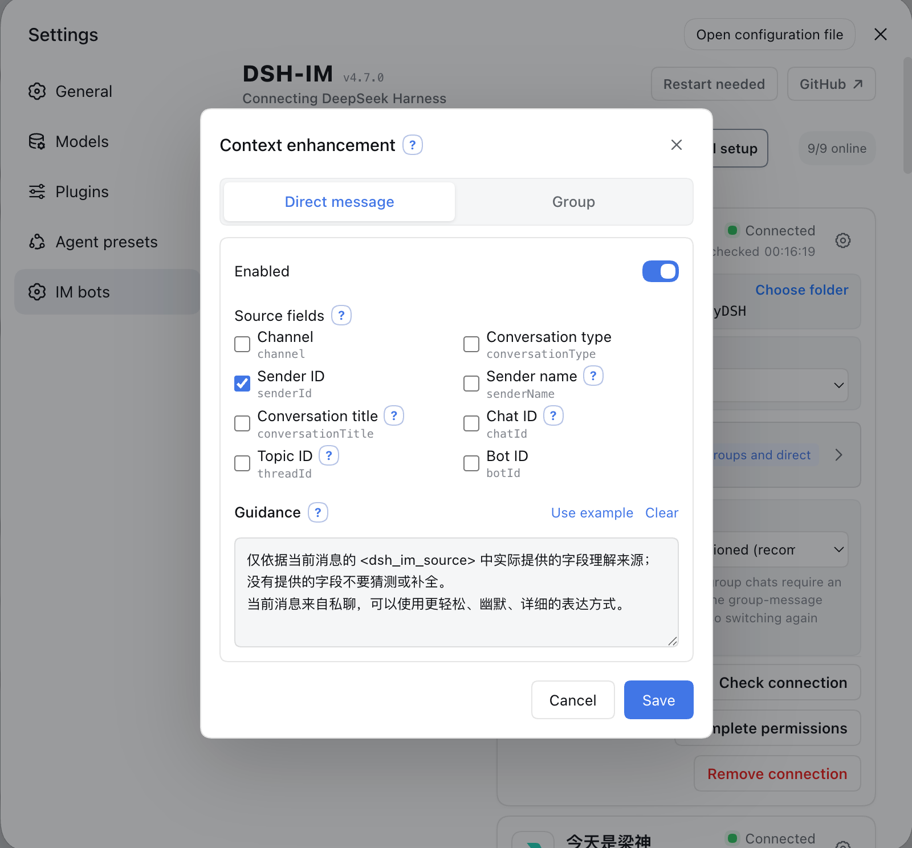
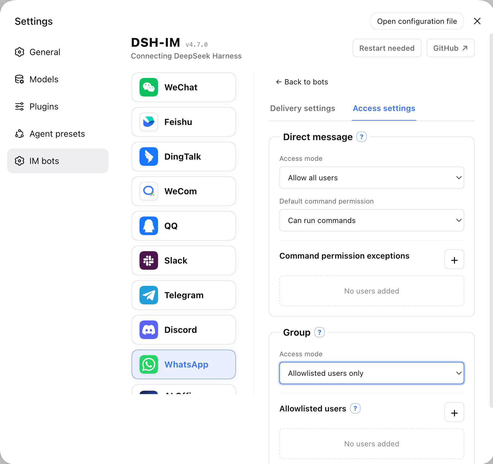

<p align="center">
  &nbsp;&nbsp;
  
</p>

---

<div align="center">
  <p><strong>Private Fork of DSH-IM — Connecting DeepSeek Harness</strong></p>

  <p>
    <a href="LICENSE"></a>
    <a href="https://www.npmjs.com/package/@feather_wch/dsh-im"></a>
    
    <a href="https://github.com/FeatherHunter/dsh-im/issues"></a>
  </p>

  <p><a href="README.md">简体中文</a> · <strong>English</strong></p>
</div>

---

> This is a private Fork of [`xmanrui/dsh-im`](https://github.com/xmanrui/dsh-im) (MIT), maintained at [`FeatherHunter/dsh-im`](https://github.com/FeatherHunter/dsh-im) on branch `private/custom` and published as [`@feather_wch/dsh-im`](https://www.npmjs.com/package/@feather_wch/dsh-im). For the full upstream documentation — nine IM channels, AI Office, commands — see 👉 **[Upstream README](https://github.com/xmanrui/dsh-im/blob/main/README.en.md)**.

> **Versioning**: `0.15.x` evolves independently as a private fork and must not be compared via `semver` with upstream `4.x` (package/ID forked to `@feather_wch/dsh-im` / `feather-wch-dsh-im`). Sync cadence: see [ADR-0001](docs/adr/0001-fork-and-branch-strategy.md).

## What's Enhanced in This Fork

`main` always mirrors upstream (`git fetch upstream && git merge --ff-only upstream/main`); all private changes live on `private/custom`. Key deltas vs upstream:

### 1. DSH → Feishu File / Image / HTML Attachment

 

Model-generated local files can be sent back to Feishu as native attachments for preview/download inside the chat.

- Recognized patterns: absolute paths inside `workspace`, Markdown images ``, and `[[file:path]]`;
- Pipeline: `src/channels/feishu/attachment-parser.mjs` + `feishu-channel.mjs: sendImage / sendFile` via `im.v1.image.create / file.create` then `msg_type: image / file`;
- Guardrails: workspace-root confinement, 5 MB per file / 20 MB total / 20 attachments per message, with user-friendly limits.

### 2. Feishu → DSH Media Hardening

Compatibility and stability fixes for mobile Feishu image/file inbound; the other 8 channels stay untouched.

- `message-utils.mjs` handles 6 mobile payload variants (`file/media`, `img.file_key`, `content.image_key`, rich-text mixed image+text) and enqueues them correctly;
- Image pre-scale: `sharp` is loaded dynamically; oversized screenshots are downscaled to 2000px on the channel side before reaching the model, avoiding per-side pixel limits;
- Same guardrails as above (5 MB / 20 MB / 20 items) plus `file-type / mime-types` sniffing.

### 3. Context-Aware Image Prompt

`src/channels/shared/image-prompt.mjs: defaultImagePrompt(N)` replaces the hardcoded “Please analyze this image.” — it adapts to batch vs single vs out-of-order image delivery for better model understanding.

### 4. Private Publish Rename

Published as `@feather_wch/dsh-im` (`cordis.patch.yml: id: feather-wch-dsh-im`) using DSH's official `dsh.bundle.patch` / `dsh.profile.bundles` mechanism: `dsh plugin add` auto-registers, `dsh plugin remove` auto-removes, no `postinstall` (pnpm v10 safe). Can coexist with upstream `@xmanrui/dsh-im` (uninstall the old one first to avoid route conflicts).

### 5. Engineering & Stability

- Removed `debug-attachments.log` instrumentation;
- Rebuilt `lib/`, added `test/channels/feishu/attachment-parser.test.mjs` and `mobile-repro.test.mjs`;
- Added `docs/adr/0001-fork-and-branch-strategy.md`, `CONTEXT.md`, and Wayfinder Map #14 to codify the `main` mirrors upstream + `private/custom` private workflow.

[Read the AI Office Connector guide](docs/AI-Office-Connector.en.md)

## Installation

### Recommended: stable npm release (DSH official bundle)

```sh
dsh plugin --profile web add -w @feather_wch/dsh-im
```

> Same mechanism as `dsh-opencode-palette`: the package ships `cordis.patch.yml` (`dsh.bundle.patch`), auto-registered into `dsh.profile.bundles` on install and removed on uninstall. No manual file edits, no postinstall. Restart `dsh web` (or refresh the page) to take effect.

Restart `dsh web`, then open **Settings → Plugins → IM Bot** and follow the in-app guide to scan a QR code or enter credentials.

### Alternative: try the latest unpublished code

```sh
# GitHub source (fetches and builds the Git dependency)
npx -y github:FeatherHunter/dsh-im install
```

> pnpm 10+ may require allowing the Git dependency to run its build script in `~/.dsh/profiles/web/pnpm-workspace.yaml`. Prefer the npm release for most users.

### Local Development
<!-- Upstream (4.x) restructured install/config docs; private install commands above -->
After installation, follow the built-in instructions on each channel page to scan a QR code or enter credentials. Secrets and Tokens are sent only to the local Harness Host and stored through its protected credential provider; status responses and bot lists never return them.

If this machine must use a forward proxy to reach Feishu, set `HTTPS_PROXY` to a full HTTP proxy URL before starting `dsh web` (for example, `http://proxy:8080`; lowercase `https_proxy` is also supported, with `HTTP_PROXY` accepted as a fallback), then restart the Host after changing it. Feishu registration and credential verification reuse the SDK's proxy-aware HTTP client, while the message WebSocket explicitly uses that proxy; the WebSocket path does not currently read `ALL_PROXY` or `NO_PROXY`.

If this machine cannot reach the Telegram Bot API directly, use Node.js 22.21 or newer and enable Node's environment proxy support before starting `dsh web`:

```sh
NODE_USE_ENV_PROXY=1 \
HTTPS_PROXY=http://proxy:8080 \
HTTP_PROXY=http://proxy:8080 \
NO_PROXY=localhost,127.0.0.1 \
dsh web
```

Use the proxy URL required by your network and restart the Host after changing it. If Telegram Bot Token binding reports that the Bot API cannot be reached, first check the proxy URL, Node.js version, and `NO_PROXY` configuration.

| Default behavior | Description |
| --- | --- |
| Bot workspace | Each bot stores its workspace independently. New bots start with the Host's current working directory, which can later be changed from the bot card. |
| Model | Every bot in all nine IM channels can choose a model directly below its workspace, or follow the Host default. A change applies only to later new Sessions; send `/new` and then an ordinary message in the current chat to use it. |
| Agent Preset | Each bot can choose an Agent Preset on its settings card. When none is chosen, new Sessions follow the Host's `agent-presets.default`. A channel-level `config.agentPreset` is only the default for later new bots on that channel. Changing the preset never modifies or clears existing Sessions; if the current chat already has a Session, send `/new` and then a regular message to create one with the new selection. |
| Context enhancement | Open settings from a bot card to enable groups and DMs independently. Both switches default to off, including for existing bots after an upgrade. |

### Proactive delivery

All nine IM channels can proactively send text through a stable `botId + targetId` pair. Bot settings support choosing a known conversation or entering a target manually, testing the current route before saving, and copying call parameters. HTTP POST, same-Host plugins, and Connection RPC share the same target configuration and delivery core.

Saved direct-message targets also offer an opt-in **Two-way Session sync** switch. Once enabled, user text submitted from DSH Web/CLI and the final assistant text in that DM's current Session are mirrored back to the DM; ordinary IM prompts and `/steer` are not duplicated. The switch follows the current Session across `/session`, `/new`, and workspace changes. The first version supports text DMs on the current Host only; groups, Topics, Threads, and explicit remote `harnessBaseUrl` connections are unavailable.

See the [Proactive Delivery Guide](PROACTIVE_DELIVERY.en.md) ([简体中文](PROACTIVE_DELIVERY.md)) for setup steps, native fields for all nine channels, complete call examples, management endpoints, error codes, and troubleshooting.

### Context enhancement

[Read the context enhancement guide](docs/context-enhancement.md)

### Access modes

[Read the access modes guide](docs/access-modes.md)

## Checking and installing updates

[Read the update-checking and installation guide](docs/checking-and-installing-updates.md)

## Bot commands

| Command | Description |
| --- | --- |
| `/help` | Show the commands and usage supported by the bot. |
| `/new` | Unbind the current chat so its next ordinary message starts a new Harness Session. |
| `/status` | Check the connection between the current bot and DeepSeek Harness. |
| `/version` | Show the version of the running dsh-im plugin. |
| `/models` | List every currently configured model with a number. |
| `/model` | Show the model and reasoning effort used by the Session bound to this chat. |
| `/model <number or provider/model-id> [reasoning effort ID]` | Switch the Session model and optionally select an effort supported by the target model. |
| `/reasoninglist`, `/reasonings` | Equivalent aliases that list the reasoning efforts supported by the current model. |
| `/reasoning` | Show the current Session model and reasoning effort. |
| `/reasoning <number or effort ID>` | Switch the current model's reasoning effort. |
| `/reasoning --default` | Restore the current model's default reasoning effort. |
| `/presetlist`, `/presets` | Equivalent aliases that list the Host's currently available Agent Presets, marking the Host default and this bot's selection. |
| `/preset` | Show this bot's Agent Preset setting for new Sessions. |
| `/preset <number or Preset ID>` | Set this bot's Agent Preset; use `/preset id:<ID>` for a numeric ID. |
| `/preset --default` | Clear this bot's explicit selection so later new Sessions follow the Host default. |
| `/stop` | Immediately stop this chat's running task while preserving work that has not started. |
| `/steer <additional instruction>` | Inject an additional instruction into this chat's running task. |
| `/batch` | Start batch input in a direct chat and collect up to 10 text messages. |
| `/send` | Submit the collected messages, in order, as one input. |
| `/cancel` | Cancel batch input and discard its collected messages. |
| `/repair` | In a Feishu direct chat, incrementally repair the card callback and permissions required for media and the native Slash Command panel. |
| `/compact` | Immediately compact older context in the Session bound to the current chat. |
| `/workspace <workspace index or absolute path>`, `/ws <workspace index or absolute path>` | Switch the current bot's Harness workspace by `/workspacelist` index or absolute path. |
| `/workspacelist`, `/workspaces`, `/wsl` | List workspace absolute paths that still exist on the current Harness Host. |
| `/sessionlist [workspace number or absolute path]`, `/sessions [...]` | Equivalent aliases that list every registered session ID and title in the selected workspace; omit the argument to use the current workspace. |
| `/sessionlist --limit N`, `/sessions --limit N` | List the first N sessions in the current workspace's existing order; N must be a positive integer. |
| `/session <Session ID>` | Bind the current chat to an existing Harness session. |
| `/history [count]` | Preview recent messages from the bound Session in a direct chat; defaults to 3, capped at 5. |
| Interactive question | Reply with an option number, option label, or custom text; separate multiple choices with commas. |
| Remote approval | Reply with `批准` / `拒绝` / `同意` / `不同意` / `yes` / `no`. |

### Command details

[Read the command details](docs/bot-commands.md)

## Other features

- **Image understanding**: all nine built-in channels can send JPEG, PNG, WebP, and GIF files sent as images to Harness, with an optional text description. Each image is limited to 5 MB, and all images in one message are limited to 20 MB in total.
- **Switch workspaces from a bot card**: every bot card on the settings page shows its current Harness workspace. Enter an existing absolute directory path directly or open the directory picker. Switching clears only that bot's old chat mappings; it never deletes, empties, or archives old Sessions. Replies already in progress may finish, while later messages use the new workspace.
- **Choose a model from a bot card**: every bot card in all nine IM channels offers the Host's available models directly below the workspace, plus an option to follow the default. The selection is stored per bot and used only for later new Sessions; existing Sessions and replies already in progress are unchanged.
- **Choose an Agent Preset from a bot card**: every bot card can select one of the Host's existing Agent Presets, or follow the Host default. The change applies only to that bot and only to later new Sessions; existing Sessions and replies already in progress are left unchanged.
- **Check the connection and send a test message**: when a bot is online, clicking **Check connection** verifies the platform connection and sends a “DeepSeek Harness connection test succeeded” message to the bot's most recently remembered direct conversation; WhatsApp uses the account's self-chat. The test neither creates a Harness Session nor invokes the model. The bot must have received at least one direct message before it has a remembered test target; otherwise the page reports that no test conversation is available yet.
- **Retry a connection or remove an integration**: when a bot is offline, its card action changes to **Retry connection**. Use **Remove integration** when the bot is no longer needed. Each action affects only the selected bot and leaves other bots and channels unchanged.
- **Manage multiple bots independently**: a channel can have multiple connected bots. Credentials, connection state, workspace, model, Agent Preset, and chat-to-Session mappings are kept separately for every bot, so card actions do not affect sibling bots.
- **Streaming replies and progress**: the plugin uses each platform's available capabilities to show thinking state, tool progress, and incremental answers. Platforms without a native streaming API complete replies through message edits, card updates, or a final message.

## Design

- Registers one top-level **IM Bot** settings page containing nine IM channels and one AI Office Connector.
- Maintains the Host, client, and runtime sources for all nine channels and the Office Connector in this repository without external standalone plugins.
- Follows the DeepSeek Harness language preference and switches the settings UI live between Chinese and English. Bot chat messages follow the Host's `language` config (Chinese by default; `en` switches them to English), with Chinese always as the fallback so untranslated text is sent verbatim.
- Uses logos for WeChat, Feishu, DingTalk, WeCom, QQ, Slack, Telegram, Discord, WhatsApp, and AI Office navigation without enable/disable switches.
- Keeps RPC endpoints, credentials, connection supervision, and session mappings isolated by IM channel; the Office Connector separately owns Device credentials, Job leases, approval waits, and concurrency limits.
- Returns only QR codes, the public Slack Manifest, redacted status data, and access modes or allowlist identifiers explicitly saved for the current Telegram or WhatsApp bot. Manually entered secrets and Tokens travel one way to the local Host; no RPC response returns App Secrets, `bot_token`, DingTalk `client_secret`, WeCom Secrets, QQ `app_secret`, Slack Bot/App Tokens, Telegram/Discord Bot Tokens, WhatsApp linked-device keys, AI Office Device Tokens, or other raw user identifiers observed from platform messages.

## Local development

```sh
npm install
npm run check   # unit tests + Host/Client build + package verification
dsh plugin --profile web add -w ./dsh-im   # or node bin/dsh-im.mjs install --source .
```

`npm run check` must stay green; `main` stays fast-forwardable to upstream — resolve conflicts only on `private/custom`.

## Feedback & Contact

Issues and PRs are welcome via [GitHub Issues](https://github.com/FeatherHunter/dsh-im/issues). You can also scan the Feishu QR code below to reach the maintainer directly. Please include `dsh --version` / `node --version` and reproduction steps, and never paste `App Secret` / `bot_token`.

<table>
  <tr>
    <th align="center">Feishu</th>
  </tr>
  <tr>
    <td align="center" valign="top">
      <a href="docs/images/feishu-qr.png"></a><br>
      <sub>Scan to add on Feishu</sub>
    </td>
  </tr>
</table>

> If you find this fork useful, please Star ⭐ and share your use case in an Issue.
