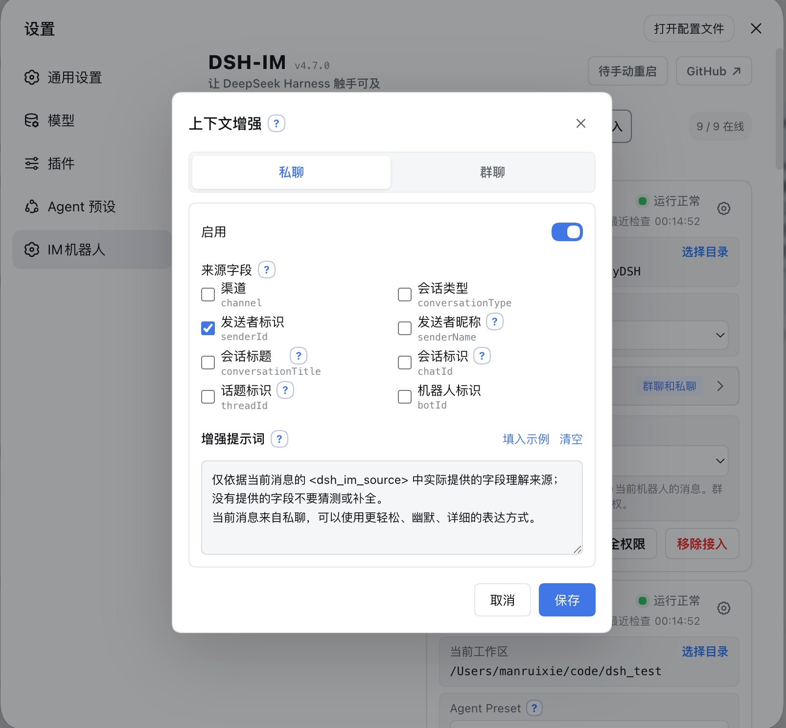

<p align="center">
  &nbsp;&nbsp;
  
</p>

---

<div align="center">
  <p><strong>FeatherHunter 私有增强版 · 让 DeepSeek Harness 触手可及</strong></p>
  <p><strong>Private Fork of DSH-IM — Connecting DeepSeek Harness</strong></p>

  <p>
    <a href="LICENSE"></a>
    <a href="https://www.npmjs.com/package/@feather_wch/dsh-im"></a>
    
    <a href="https://github.com/FeatherHunter/dsh-im/issues"></a>
  </p>

  <p><strong>简体中文</strong> · <a href="README.en.md">English</a></p>
</div>

---

> 本仓库是 [`xmanrui/dsh-im`](https://github.com/xmanrui/dsh-im) 的 Fork（MIT），由 [`FeatherHunter/dsh-im`](https://github.com/FeatherHunter/dsh-im) 在 `private/custom` 分支持续维护，发布为 [`@feather_wch/dsh-im`](https://www.npmjs.com/package/@feather_wch/dsh-im)。上游的完整功能文档、九通道接入、AI Office 与命令说明请见 👉 **[原作者 README](https://github.com/xmanrui/dsh-im/blob/main/README.md)**。

> **版本说明**：`0.15.x` 为私版独立演进，与上游 `4.x` 不可比 `semver`（包名 `@feather_wch/dsh-im` 与 ID `feather-wch-dsh-im` 已分叉），同步节奏见 [ADR-0001](docs/adr/0001-fork-and-branch-strategy.md)。

通过扫码、App Manifest 或已有机器人凭据把 IM 机器人接入 DeepSeek Harness，并让本机 Harness 主动连接公网 AI Office。一个插件、一个设置入口，统一管理九种 IM 渠道和 AI Office Connector。**每个 IM 渠道都支持接入多个机器人**，各机器人的连接状态、工作区、模型和会话绑定彼此独立。

## 本 Fork 做了什么

`main` 分支永远镜像上游（`git fetch upstream && git merge --ff-only upstream/main`），私有定制全部沉淀在 `private/custom`。相较上游，当前私版核心增量如下：

### 1. DSH → 飞书附件回传（模型可发文件）

模型在回复中产生的本地文件可自动作为附件回传到飞书聊天框内预览/下载，无需用户手动搬运。

 

- 解析规则：`workspace` 内绝对路径、`` Markdown 图片、`[[file:path]]` 三类均识别为附件；
- 通道：`src/channels/feishu/attachment-parser.mjs` + `feishu-channel.mjs: sendImage / sendFile`，经 `im.v1.image.create / file.create` 再以 `msg_type: image / file` 发送；
- 安全与限额：仅 `workspace` 根内文件、单张 5 MB / 总量 20 MB / 单消息 20 个附件，超出给出友好提示。

### 2. 飞书 → DSH 媒体通道增强

解决手机端图片/文件入站的兼容与稳定性问题，保持其余 8 渠道不动。

- `message-utils.mjs` 兼容移动端 6 类 payload（`file/media`、`img.file_key`、`content.image_key` 等）与富文本图文混排，按 `Harness` 入库时拆条入队；
- 图片预缩放：`sharp` 动态加载，通道侧将超大截屏预缩至 2000px 再入库，避免触发模型侧像素超限；
- 限额与校验复用：与附件回传一致的 5 MB/20 MB/20 个 + 根校验 + `file-type / mime-types` 嗅探。

### 3. 图片提示词优化

`src/channels/shared/image-prompt.mjs: defaultImagePrompt(N)` 替代硬编码“请分析这张图片。”：按消息内图片数量自动区分强关联批图、孤图、乱序拆条等场景，提升模型对多图的理解。

### 4. 私有发布更名

发布为 `@feather_wch/dsh-im`（`cordis.patch.yml: id: feather-wch-dsh-im`），采用 DSH 官方 `dsh.bundle.patch` / `dsh.profile.bundles` 机制：`dsh plugin add` 自动注册、`dsh plugin remove` 自动移除，无 `postinstall`（pnpm v10 安全），可与上游 `@xmanrui/dsh-im` 并存（需先卸载旧包避免路由冲突）。

### 5. 工程化与稳定性

- 移除 `debug-attachments.log` 调试落盘；
- 重建 `lib/` 产物，补 `test/channels/feishu/attachment-parser.test.mjs` 与 `mobile-repro.test.mjs`；
- 沉淀 `docs/adr/0001-fork-and-branch-strategy.md`、`CONTEXT.md` 与 Wayfinder Map #14，明确 `main` 镜像 + `private/custom` 私改的协作契约。

[查看 AI Office Connector 说明](docs/AI-Office-Connector.md)

## 安装

### 推荐：从 npm 安装稳定版（DSH 官方 bundle）

```sh
dsh plugin --profile web add -w @feather_wch/dsh-im
```

> 与 `dsh-opencode-palette` 一致，本包自带 `cordis.patch.yml`（声明 `dsh.bundle.patch`），安装后自动加入 `dsh.profile.bundles`，DSH 启动时直接装配；卸载时自动移除。全程无需手动编辑文件，不依赖 pnpm 构建脚本。重启 `dsh web`（或刷新浏览器页面）即生效。

重启 `dsh web` 后打开「设置 → 插件 → IM机器人」按引导完成扫码或凭据绑定即可。

### 备用：试用未发布到 npm 的最新代码

```sh
# GitHub 源安装（会拉取并构建 Git 依赖）
npx -y github:FeatherHunter/dsh-im install
```

> pnpm 10+ 可能需在 `~/.dsh/profiles/web/pnpm-workspace.yaml` 中放行该 Git 依赖的构建脚本。普通用户优先使用 npm 稳定版。

### 本地开发
<!-- 上游（4.x）重构后的安装与配置说明，私版安装命令见上文 -->
安装后，在对应渠道页面按照内置引导完成扫码或凭据配置。所有 Secret 和 Token 只提交给本机 Harness Host，并写入受保护的凭据存储；状态接口和机器人列表不会回传这些凭据。

如果本机必须通过正向代理访问飞书，请在启动 `dsh web` 前把 `HTTPS_PROXY` 设置为包含协议的 HTTP 代理 URL（例如 `http://proxy:8080`；也支持小写 `https_proxy`，并兼容使用 `HTTP_PROXY` 作为回退），修改后重启 Host。飞书注册和凭据验证会复用 SDK 的代理感知 HTTP 客户端，消息长连接会显式通过这个代理建立 WebSocket；长连接目前不读取 `ALL_PROXY` 或 `NO_PROXY`。

如果本机无法直连 Telegram Bot API，请使用 Node.js 22.21 或更高版本，并在启动 `dsh web` 前启用 Node 的环境变量代理支持：

```sh
NODE_USE_ENV_PROXY=1 \
HTTPS_PROXY=http://proxy:8080 \
HTTP_PROXY=http://proxy:8080 \
NO_PROXY=localhost,127.0.0.1 \
dsh web
```

代理地址按本机网络环境填写；修改代理后需要重启 Host。绑定 Telegram Bot Token 时，如果页面提示无法访问 Bot API，请优先检查代理地址、Node.js 版本和 `NO_PROXY` 配置。

| 默认行为 | 说明 |
| --- | --- |
| 机器人工作区 | 每个机器人独立保存工作区。新机器人默认使用 Host 当时的工作目录；之后可在机器人卡片中修改。 |
| 模型 | 九个 IM 渠道的每个机器人都可在工作区下方独立选择模型；未选择时跟随 Host 默认。切换只影响之后新建的会话；当前聊天先发送 `/new`，再发送普通消息才会使用新选择。 |
| Agent Preset | 每个机器人可在设置页卡片中选择 Agent Preset。未选择时跟随 Host 的 `agent-presets.default`；渠道级 `config.agentPreset` 只作为该渠道之后新接入机器人的默认值。切换不会修改或清空已有会话；若当前聊天已有会话，需先发送 `/new`，再发送一条普通消息，才会按新选择创建会话。 |
| 上下文增强 | 从机器人卡片打开设置，分别决定群聊、私聊是否增强；两个开关默认均关闭，旧机器人升级后也不会自动开启。 |

### 主动投递

九个 IM 渠道都可以使用稳定的 `botId + targetId` 主动发送文字消息。机器人设置页支持从已聊会话选择或手工填写目标、保存前测试当前路由，以及复制调用参数；HTTP POST、同 Host 插件和 Connection RPC 共用同一目标配置与投递核心。

已保存的私聊目标还可以开启默认关闭的「会话双向同步」。开启后，DSH Web／CLI 在该私聊当前 Session 中发送的用户文字和最终助手文字会同步回私聊；IM 侧原有提问与 `/steer` 不会重复。开关自动跟随 `/session`、`/new` 和工作区切换后的当前 Session。首版仅支持当前 Host 的私聊文字；群聊、Topic、Thread 与显式远程 `harnessBaseUrl` 不支持。

设置步骤、九渠道字段、完整调用示例、管理端点、错误码与排错说明请查看[《主动投递使用指南》](PROACTIVE_DELIVERY.md)（[English](PROACTIVE_DELIVERY.en.md)）。

### 上下文增强

[查看上下文增强说明](docs/上下文增强.md)

### 访问模式

[查看访问模式说明](docs/访问模式.md)

## 检查与安装更新

[查看检查与安装更新说明](docs/检查与安装更新.md)

## 机器人命令

| 命令 | 作用 |
| --- | --- |
| `/help` | 显示机器人支持的命令和用法。 |
| `/new` | 解除当前聊天的会话绑定，让下一条普通消息开启全新 Harness 会话。 |
| `/status` | 检查当前机器人与 DeepSeek Harness 的连接状态。 |
| `/version` | 查看当前运行的 dsh-im 插件版本。 |
| `/models` | 按序号列出当前配置的全部可用模型。 |
| `/model` | 查看当前聊天绑定会话正在使用的模型和推理等级。 |
| `/model <序号或 Provider/模型ID> [推理等级ID]` | 切换当前会话模型，并可同时指定目标模型支持的推理等级。 |
| `/reasoninglist`、`/reasonings` | 等价命令；列出当前模型支持的推理等级。 |
| `/reasoning` | 查看当前会话的模型和推理等级。 |
| `/reasoning <序号或等级ID>` | 切换当前模型的推理等级。 |
| `/reasoning --default` | 恢复当前模型的默认推理等级。 |
| `/presetlist`、`/presets` | 两个等价命令；按序号列出 Host 当前可用的 Agent Preset，并标记 Host 默认项和当前机器人的选择。 |
| `/preset` | 查看当前机器人的新会话 Agent Preset 设置。 |
| `/preset <序号或 Preset ID>` | 设置当前机器人的 Agent Preset；纯数字 ID 使用 `/preset id:<ID>`。 |
| `/preset --default` | 清除当前机器人的显式选择，让后续新 Session 跟随 Host 默认。 |
| `/stop` | 立即停止当前聊天正在运行的任务，并保留尚未开始的排队消息。 |
| `/steer <补充指令>` | 把补充指令立即加入当前聊天正在运行的任务。 |
| `/batch` | 在私聊中开启批量输入，最多收集 10 条纯文字消息。 |
| `/send` | 将已收集的消息按原顺序作为一次输入提交。 |
| `/cancel` | 取消批量输入并丢弃已收集的消息。 |
| `/repair` | 在飞书私聊中增量修复卡片回调，并补全媒体与原生 Slash Command 面板所需的权限。 |
| `/compact` | 立即压缩当前聊天绑定会话的较早上下文。 |
| `/workspace <工作区序号或绝对路径>`、`/ws <工作区序号或绝对路径>` | 按 `/workspacelist` 序号或绝对路径切换当前机器人的 Harness 工作区。 |
| `/workspacelist`、`/workspaces`、`/wsl` | 列出当前 Harness Host 上仍然存在的工作区绝对路径。 |
| `/sessionlist [工作区序号或绝对路径]`、`/sessions [...]` | 两个等价命令；列出指定工作区登记的所有会话 ID 和标题，省略参数时使用当前工作区。 |
| `/sessionlist --limit N`、`/sessions --limit N` | 列出当前工作区现有顺序中的前 N 个会话；N 必须是正整数。 |
| `/session <Session ID>` | 将当前聊天绑定到指定的已有 Harness 会话。 |
| `/history [数量]` | 在私聊中查看当前绑定会话的最近历史消息，默认 3 条，最多 5 条。 |
| 交互式提问 | 回复选项序号、选项文字或自定义文字；多选时用逗号分隔。 |
| 远程审批 | 回复 `批准` / `拒绝` / `同意` / `不同意` / `yes` / `no`。 |

### 命令说明

[查看命令说明](docs/机器人命令.md)

## 其它功能

- **图片识别**：九个内置渠道都可以把 JPEG、PNG、WebP，以及以图片文件方式发送的 GIF 交给 Harness；图片可以附带文字说明。单张图片上限为 5 MB，单条消息中的图片总大小上限为 20 MB。
- **在机器人卡片切换工作区**：设置页中的每张机器人卡片都会显示当前 Harness 工作区。可以直接填写已有目录的绝对路径，也可以打开目录选择器。切换只清除该机器人的旧聊天映射，不会删除、清空或归档旧 Session；已经开始的回复可以继续完成，后续消息使用新工作区。
- **在机器人卡片选择模型**：九个 IM 渠道的每张机器人卡片都在工作区下方提供模型选择，可选 Host 当前可用模型或跟随默认。选择按机器人独立保存，只用于之后新建的 Session；已有 Session 和正在生成的回复不受影响。
- **在机器人卡片选择 Agent Preset**：设置页中的每张机器人卡片都可以选择 Host 已有的 Agent Preset，或跟随 Host 默认。切换只作用于该机器人，并且只影响之后新建的会话；已有会话和正在生成的回复不受影响。
- **检查连接并发送测试消息**：机器人在线时，点击卡片上的「检查连接」会检查平台连接，并向该机器人最近记录的私聊发送一条“DeepSeek Harness 连接测试成功”消息；WhatsApp 会发送到账号自聊。测试消息不会创建 Harness Session，也不会调用模型。机器人必须至少收到过一条私聊才能记住测试目标，否则页面会提示尚无可用的测试会话。
- **重试连接和移除接入**：机器人离线时，卡片上的操作会变为「重试连接」；不再使用时可以点击「移除接入」。这些操作都只作用于所选机器人，不影响其他机器人或渠道。
- **多机器人独立管理**：同一渠道可以接入多个机器人。每个机器人分别保存凭据、连接状态、工作区、模型、Agent Preset 和聊天会话映射，卡片上的工作区、模型、Preset、连接检查、重试和移除操作互不影响。
- **流式回复和进度提示**：插件会按各平台能力显示正在思考、工具执行和逐步生成的回答；不支持原生流式接口的平台会通过编辑消息、卡片更新或最终消息完成回复。

## 设计

- Harness 一级设置菜单中只注册一个「IM机器人」设置页，其中包含九个 IM 渠道和一个 AI Office Connector；
- 九个渠道及 Office Connector 的 Host、客户端与运行时源码都在本仓库维护，不依赖外部独立插件；
- 设置页跟随 DeepSeek Harness 的语言选择，在中文和 English 之间即时切换；机器人发出的聊天消息跟随 Host 的 `language` 配置（默认中文；设为 `en` 即为英文），中文始终为兜底，未收录的文案原样输出；
- 左侧使用 Logo 切换微信、飞书、钉钉、企业微信、QQ、Slack、Telegram、Discord、WhatsApp 和 AI Office，不使用启用/停用开关；
- 九个 IM 渠道保持独立的 RPC、凭据、连接监督和会话映射；Office Connector 另行维护设备凭据、Job 租约、审批等待与并发上限；
- 浏览器只获得二维码、Manifest、脱敏状态，以及用户为当前 Telegram 或 WhatsApp 机器人主动保存的访问模式和白名单标识；手动输入的 Secret 或 Token 仅单向提交给本机 Host，任何 RPC 响应都不会返回 App Secret、`bot_token`、钉钉 `client_secret`、企业微信 Secret、QQ `app_secret`、Slack Bot/App Token、Telegram/Discord Bot Token、WhatsApp 关联设备密钥、AI Office Device Token，或从平台消息中观察到的其他原始用户标识。

## 本地开发

```sh
npm install
npm run check   # 单测 + 构建 Host/Client + 发布包校验
dsh plugin --profile web add -w ./dsh-im   # 或 node bin/dsh-im.mjs install --source .
```

`npm run check` 必须全绿；`main` 保持可一键同步上游，冲突仅在 `private/custom` 解决。

## 反馈与联系

欢迎提交 [Issue](https://github.com/FeatherHunter/dsh-im/issues) 反馈问题或需求，也可扫码添加飞书直接联系作者。提交 Issue 时请附 `dsh --version` / `node --version` / 复现步骤，勿贴 `App Secret` / `bot_token` 等敏感信息。

<table>
  <tr>
    <th align="center">飞书</th>
  </tr>
  <tr>
    <td align="center" valign="top">
      <a href="docs/images/feishu-qr.png"></a><br>
      <sub>扫码添加飞书</sub>
    </td>
  </tr>
</table>

> 喜欢本 Fork？欢迎 Star ⭐ 并在 Issue 中分享你的使用场景。
