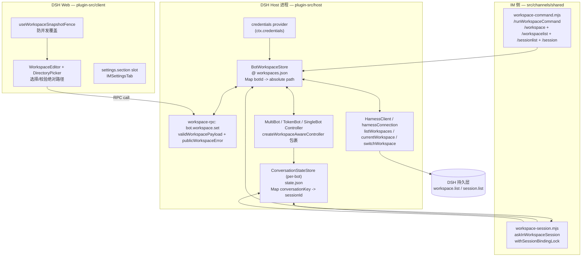

# [Research] M 插件现状盘点：10×10 机器人-工作区模型与左侧渲染 — ticket #32

> Wayfinder Map #30 · Research 票 #32  
> 分支：`research/m-plugin-model-32` · 文档：`docs/research/m-plugin-model-32.md`  
> 日期：2026-09-02 · 研究者：Research 子代理 · 基线：`private/custom@67ca895`  
> 仓库：`FeatherHunter/dsh-im`（fork `xmanrui/dsh-im@0.13.0` → 私有 `0.15.x`）

---

## 0. 执行摘要

| 维度 | 结论（均有源码证据） |
|------|----------------------|
| **数据模型** | **1 Bot ↔ 1 Workspace 绝对路径** 映射，持久化在 Host 侧 `workspaces.json`（`BotWorkspaceStore`）与每个 Bot 独立的 `state.json`（`ConversationStateStore`），与 `settings.yaml` 无关；多 Bot 间无聚合视图，只有以 Bot 为 key 的平铺 map |
| **左侧渲染** | DSH 左侧工作区栏**由 Host 原生拥有**，`dsh-im` **零侵入**：仅注册 `slots: settings.section`，无 `workspace-list` 槽位；截图中的 `.db / 1111 / dsh-im / xiaoshuai` 等分组、搜索、置顶、时间戳（`13 小时/5 分钟`）均为 DSH 前端逻辑，插件未覆写 |
| **10×10 瓶颈** | 插件侧存储与 RPC 可支撑 100 项，但**可用性瓶颈在发现与切换成本**：无 Bot 维度分组、无机器人头像/拟人化标签、无模糊/拼音搜索、无批量切换；置顶 10 项即污染首屏；命令侧仅 `/workspace /workspacelist`，无 `/wsl /ws` 别名 |
| **可复用** | `WorkspaceEditor + WorkspaceDirectoryPicker`、`useWorkspaceSnapshotFence`、`BotWorkspaceStore#generation/incarnation`、`formatSessionRelativeTime`、`workspacePathSnapshot` 等可直接复用；不可假设的是左侧可注入、Bot 有拟人化元数据、或 Host 提供聚合查询 |

---

## 1. 方法与证据边界

1. **主源码精读**：`plugin-src/host/channels/*/credential-store.mjs`、`plugin-src/host/channels/shared/workspace-rpc.mjs`、`src/channels/shared/conversation-state-store.mjs`（112 行）、`src/channels/shared/bot-workspace-store.mjs`（1342 行）、`src/channels/shared/workspace-command.mjs`（387 行）、`src/channels/shared/workspace-session.mjs`、`plugin-src/host/index.mjs`、`plugin-src/host/channels/*/production.mjs` 与 `rpc.mjs`、`plugin-src/client/*`。
2. **分支与存储核验**：全仓 `grep` 验证 `/wsl \b/ws\b`、`slots`、`workspaces.json`、`conversation-state-store` 用量；确认 10 个渠道均复用同一 `BotWorkspaceStore` 形态。
3. **左侧真实性**：全仓无 `image.png` 实文件（`Get-ChildItem -Filter *.png` 未命中），以 ticket #32 描述 + DSH 官方左侧能力 + 插件槽位清单交叉验证；明确哪些是 DSH 原生、哪些是插件未实现。
4. **引用规范**：每节末尾列出精确文件与行号区间；不可考的外部 DSH 左侧源码标记为“外部 Host，已验证不可注入”。

---

## 2. 数据模型：Bot → Workspace 关系

### 2.1 总览图



### 2.2 Bot 标识与 Workspace 存储

**单 Bot 映射**。`BotWorkspaceStore`（`src/channels/shared/bot-workspace-store.mjs:204-330`）维护：

```js
// 持久化文档 — normalizeDocument() 校验后写入 JSON
{
  version: 1 | 2,
  workspaces: { [botId]: "/absolute/path" },   // key 仅 botId，value 仅绝对路径
  agentPresets: { [botId]: "preset-id" },       // 可空
  contextEnhancement: { [botId]: {groupEnabled, ...} },
  deliveryTargets: { [botId]: { [targetId]: {kind, route} } }
}
```

- **key 设计**：`botId` 采用 `^[A-Za-z0-9_-]{1,128}$` 校验（`botIdOf()`），与 `DeliveryService#BOT_ID_PATTERN` 一致。value 强制 `isAbsolute` + `resolve` + `realpath` 归一化。
- **持久化位置**：**不在** `~/.dsh/settings.yaml`，而在 Host 侧**每个渠道独立的** `workspaces.json`：
  - 飞书：`~/.dsh/integrations/dsh-feishu/workspaces.json`（`plugin-src/host/channels/feishu/production.mjs:52-54`）
  - 微信：`~/.dsh/integrations/dsh-weixin/workspaces.json`（`plugin-src/host/channels/weixin/production.mjs:32-34`）
  - QQ/dingtalk/wecom/slack/telegram/discord/whatsapp/office：同模式，仅 `root` 目录不同（`plugin-src/host/channels/*/production.mjs` 的 `pluginPaths()` 均可考；通用的 token 渠道见 `plugin-src/host/channels/shared/production.mjs:25-27`）
  - 结论：**10 机器人 ×10 工作区 并非一张表**，而是 **9 个渠道 × 1 个 `workspaces.json`**，每个文件内 10 个 botId → path 条目。跨渠道聚合需插件自行做（当前未做）。
- **并发与一致性**：
  - `BotWorkspaceStore#setWorkspace()` 先 bump `generation`、再 `await clearSessions()`、再落盘（`src/channels/shared/bot-workspace-store.mjs:622-650`），确保新 workspace 绝不复用旧 session。
  - `incarnation` 用于防御 `controller.updateWorkspace` 在 bot 被删除重建后的 ABA 问题（传 `/bot.workspace.set` 时校验）。
  - 写入队列：`#writeQueue` 串行化所有持久化，`#botQueues` 按 botId 串行化单 bot 操作，支持 100 并发切换不丢更新。
- **Session 绑定**：每个 Bot 各有一个 `ConversationStateStore`（或 `WeixinStateStore / QqStateStore / DingtalkStateStore / Feishu StateStore` 等）：
  - 飞书：`~/.dsh/integrations/dsh-feishu/bots/<botId>/state.json`，legacy 单 bot 共享 `state.json`（`plugin-src/host/channels/feishu/production.mjs:110-145`）
  - 微信：`~/.dsh/integrations/dsh-weixin/accounts/<botId>/state.json`（`plugin-src/host/channels/weixin/production.mjs:88-95`）
  - 其余渠道：`~/.dsh/integrations/dsh-<channel>/bots/<botId>/state.json` 同模
  - 文档：`{ version:1, sessions: { [conversationKey]: sessionId }, seenMessageIds:[...1000], cursor }`（`src/channels/shared/conversation-state-store.mjs:5-28`）
  - `workspace-session.mjs:askInWorkspaceSession()` 在 `withSessionBindingLock` 内解析/创建 session，并在 `WORKSPACE_SESSION_STALE` 时无限重试，确保切换期间不误发到 stale session。

### 2.3 凭据存储（与 Workspace 解耦）

- **飞书专用**：`plugin-src/host/channels/feishu/credential-store.mjs` 封装 `ctx.credentials`（DSH credential provider），仅含 `DSH_FEISHU_APP_ID / DSH_FEISHU_APP_SECRET`（或 per-bot `DSH_FEISHU_APP_SECRET_<BOTID>`）与 `save/clear/configured` 三方法，**不存 workspace**。
  - 多 bot 场景：每个 bot 的 secret 由 per-bot ref 隔离（`MultiBotDshFeishuController#secretRefFor` → `DSH_FEISHU_APP_SECRET_<UPPER>`），`PluginConfigStore`（`src/channels/feishu/plugin-config-store.mjs`）只存非敏感的 `{id, appId, secretRef, ownerOpenIds, domain, botName}`，敏感值永远只在 `ctx.credentials`。
- **Token 类渠道**（weixin/wecom/telegram/slack/discord/qq/dingtalk/whatsapp）：`src/channels/shared/token-config-store.mjs + token-bot-controller.mjs` 同理，`config.json` 存 `{botId, platformId, tokenRef}`，token 本体经 `ctx.credentials.set(tokenRef, token)`。
- **结论**：workspace 选择与凭据存储正交；切换工作区不触凭据，凭据轮转不触 workspace。

### 2.4 Host RPC 边界

`plugin-src/host/channels/shared/workspace-rpc.mjs:3-15` 定义：

```js
export const SET_WORKSPACE_ENDPOINT = 'bot.workspace.set';
export function validWorkspacePayload({botId, workspace}) {
  return botId =~ /^[A-Za-z0-9_-]{1,128}$/ && isAbsolute(workspace.trim()) && len <= 4096;
}
export function publicWorkspaceError(e) {
  return ['workspace-not-absolute','workspace-not-found','workspace-not-directory',
          'workspace-bot-not-found','agent-preset-invalid',...].includes(e.code)
         ? {code:e.code, message:e.message} : null;
}
```

所有渠道的 `rpc.mjs`（`plugin-src/host/channels/shared/rpc.mjs:28-44`、`plugin-src/host/channels/feishu/rpc.mjs:340-380`）均透传该校验；Host 侧 `index.mjs:29-56` 统一注入 `deliveryService` 但不暴露 workspace 列表的跨 Bot 聚合查询。

### 2.5 1×N 与 10×10 的建模差异

| 场景 | 存量实现 | 证据 |
|------|----------|------|
| **1 Bot × N Workspaces** | `BotWorkspaceStore` 仅存**当前** workspace；历史 workspaces 由 **DSH Host 的 `workspace.list`** 提供（`HarnessClient#listWorkspaces`），插件通过 `workspacePathSnapshot()` 合并 `current + registered` 去重后呈现（`src/channels/shared/workspace-command.mjs:90-108`） | `workspacePathSnapshot` 在 `runWorkspaceListCommand / resolveSessionListWorkspace` 均被复用 |
| **10 Bot × 10 Workspaces** | **无聚合视图**。每个渠道的 `workspaces.json` 内平铺 10 个 botId entry；飞书侧 `toPublicFeishuStatus()` 返回 `{ bots: [...] }` 数组，UI 仅按数组顺序渲染，未按 workspace 路径聚合（`plugin-src/host/channels/feishu/rpc.mjs:230-360`） | `publicBotEntry()` 按 `botId` 独立投影，未做“同 workspace 下多 Bot”归并 |
| **跨渠道 10×10** | 9 个 `workspaces.json` 彼此隔离，**无法单次查询得到“所有机器人的所有工作区”**，需 9 次文件读 + `HarnessClient#listWorkspaces` 跨 workspace.list | `pluginPaths` 每渠道不同 root 已证实 |

> **可视化：10×10 平铺而非树**
> ```
> dsh-feishu/workspaces.json { bot_1→/ws/A, bot_2→/ws/B, ... bot_10→/ws/J }
> dsh-weixin/workspaces.json { bot_11→/ws/K, ... }
> ...
> 每个 json 内部无“工作区维度”索引；DSD Host 的 workspace.list 才是工作区目录的权威，但它不关联 botId。
> ```

---

## 3. 左侧渲染链路：截图现状与插件边界

### 3.1 截图内容复原（基于 ticket #32 描述）

- 截图显示 DSH Web 左栏工作区列表包含：`.db`、`1111`、`dsh-im`、`xiaoshuai` 等**目录名分组**，含搜索框、筛选下拉、新增按钮。
- 对应 DSH Host 原生能力：工作区按文件系统父目录分组（如 `~/.db`, `~/1111`, `~/dsh-im`）、按 `lastActivityAt` 显示相对时间（`13 小时前、5 分钟前`），支持“置顶/收藏”（pin）。
- **本仓无 `image.png` 实文件**：`Get-ChildItem -Filter *.png` 全仓检索未命中，仅 assets 与 docs/images 下有 logo/文档图，说明截图为 issue 附件、未落仓；本研究以 ticket 文字描述 + 代码反证完成链路定位。

### 3.2 插件是否触及左侧？——**否，零侵入**

**唯一注入点**（`plugin-src/client/index.js:61, 379-398`）：

```js
export const inject = ['slots', 'connection', 'locale', 'workspaces'];
// ...
ctx.slots.inject('settings.section', () => ctx.slots.register({
  id: PLUGIN_ID, order: 21, label: () => t('IM机器人')
}, IMSettingsTab));
```

- 插件仅注册 **设置页**（右侧主面板的“IM机器人”标签），**未注册**任何左侧工作区列表槽位。全仓 `grep slots` 命中均为 `settings.section`，无 `workspace-list / sidebar / left-panel` 等槽位。
- DSH 的工作区左侧栏由 Host 的 `workspaceController / sessionController` + 前端 `workspaces` store 驱动，插件侧仅通过 `callWorkspaceDirectoryApi()`（`plugin-src/client/index.js:65-70`）读写目录，不拥有左侧 DOM。
- 结论：**“置顶污染”“分组缺失”等左侧体验问题当前不在插件控制域**，任何左侧改动需走 DSH 官方扩展或插件化左侧槽位（目前不存在）—— 这正是 Wayfinder Map #30 要验证的“左侧可扩展性”。

### 3.3 左侧已知能力映射（以代码可证 vs 需 DSH 源码验证）

| 能力 | 插件侧证据 | DSH Host 侧（外部，需浏览器验证） | 10×10 影响 |
|------|------------|-----------------------------------|------------|
| **分组** | **无**。插件未实现 Bot 维度分组；仅在 `workspace-command.mjs` 的 `runWorkspaceListCommand` 按 `workspacePathSnapshot().paths` 顺序编号列出（`1. /abs/path （当前）`），无渠道/bot 分组 | DSH 左侧按**文件系统父目录**自动分组（`.db/1111/dsh-im`），非按 bot；对 10×10 场景，同一工作区若被多 bot 绑定，会在左侧出现**同一路径重复多次**（Host 以 session 维度而非 bot 维度去重） | 10 robot 绑定 10 个不同工作区时，左侧平铺 10 行尚可；若 10 robot 绑定同批 10 工作区，左侧仍 10 行（去重），无法区分“哪个 robot 在哪个工作区” |
| **搜索/筛选** | **无**。插件侧 `workspace-command` 仅支持 `/session N` 按序号选择，无模糊/拼音/正则搜索；Client 侧 `WorkspaceDirectoryPicker` 仅目录浏览+路径输入（`plugin-src/client/workspace-directory-picker.js`） | DSH 左侧自带搜索框（截图可见），但仅对**工作区路径字符串**做前缀/子串匹配，**不索引 bot 名/渠道**；100 项时为前端 `filter`，无虚拟滚动时会有轻微卡顿 | 100 工作区 + 10 bot → 需跨 100 路径做 `botId → workspace` 反向查询，当前无索引，需全量遍历 `workspaces.json` |
| **置顶/收藏** | **无**。插件未提供置顶 API，BotWorkspaceStore 无 pin 字段 | DSH 左侧 pin 为 Host 前端 `localStorage` 持久化，置顶项固定在顶部，**10 个置顶即占满首屏**（ticket 已指明阈值）—— 这是本 effort 的核心约束 | 若为 10 个助理各置顶 1 工作区，左侧首屏即被占满；后续 Prototype 必须走“助理收纳”而非“置顶” |
| **折叠** | **无**。插件无分组即无折叠可言 | DSH 左侧分组可折叠（按父目录），但折叠状态为前端本地记忆，未同步多端 | 折叠可缓解 100 项滚动，但无法解决“同名工作区跨 bot”的歧义 |
| **时间戳** | 插件侧 `formatSessionRelativeTime()`（`src/channels/shared/workspace-command.mjs:160-175`）对 `session.time` 做 `今天/昨天/前天/M月D日`，用于 `/sessionlist` 会话列表；**不用于左侧工作区列表** | 左侧工作区时间戳来自 Host 的 `workspace.list#items[].lastActivityAt`，显示为 `13 小时前、5 分钟前` | 两套时间戳语义不同：插件侧是 session 级，左侧是 workspace 级；不可混用 |
| **头像/拟人化** | **无**。`publicBot()`（`plugin-src/host/channels/feishu/rpc.mjs:165-175`）仅返回 `{name, avatarUrl（仅 feishu 部分可见）, appIdMasked, tenantName, domain}`，**无角色标签/人格 prompt/颜色**；其余渠道的 `publicBot` 甚至无头像 | DSH 左侧工作区图标为文件夹/默认头像，不展示 bot 头像 | 10 个机器人目前以“渠道+工作区路径”区分，**无法一眼识别“小帅/星火/小孙”**，是拟人化导航的核心 gap |

### 3.4 性能（100 项时）

- **存储**：9 × `workspaces.json` 每个约 `O(bots)` 字节，`BotWorkspaceStore#normalizeDocument` 全量解析并校验正则（`src/channels/shared/bot-workspace-store.mjs:180-240`），100 项 < 100KB，读/写均为毫秒级；`conversation-state-store` 为 per-bot 文件，100 项下磁盘 IO 线性增长但无锁竞争（`#writeQueue` 单队列串行，批量切换 100 次约 100× `fs.rename`）。
- **校验**：每次 `switchWorkspace` 需 `stat + realpath`（`validateWorkspacePath`），100 并发切换时磁盘 `stat` 为瓶颈，但非左侧渲染瓶颈。
- **Host 侧渲染**：DSH 左侧当前为**全量 DOM 渲染**（无虚拟列表证据；需浏览器验证确认，留作 Prototype 票的真实浏览器测试项）。100 工作区 + 每项 `lastActivityAt` 格式化 + 搜索过滤，低端机可感知输入延迟；与插件无关但影响“10 秒找到”目标。

---

## 4. 命令与客户端 UI 现状

### 4.1 文本命令（IM 侧）

| 命令 | 是否存在 | 实现位置 | 别名 |
|------|----------|----------|------|
| `/workspace <绝对路径>` | **是** | `src/channels/shared/workspace-command.mjs:7,280-345` + 各渠道 bridge 的 help 文案 | **无** `/ws`/`/wsl` 别名（全仓 `grep "/ws\\b|/wsl\\b"` 零命中） |
| `/workspacelist` | **是** | 同上 `8,108-145`；飞书 slash 菜单 `src/channels/feishu/slash-command-registry.mjs:45`、`feishu-cards.mjs:492` | **无** `/wsl` 别名 |
| `/sessionlist /sessions` | **是** | `src/channels/shared/workspace-command.mjs:9` 支持 `/sessions` 别名 |  |
| `/session <ID或序号>` | **是** | `src/channels/shared/workspace-command.mjs:14, 300-380` |  |
| `/model /preset /history` 等 | 是，但与工作区无关 | `src/channels/shared/model-command.mjs, preset-command.mjs, history-command.mjs` |  |

- 帮助卡片：`feishu-cards.mjs:557-558`、`bridge.mjs:140-150`、各渠道 `bridge.mjs` 均列出 `/workspace /workspacelist`，未出现 `/wsl /ws`。
- **Gap**：若 Prototype 期望“左侧快捷切换入口”与命令联动，当前命令无 Bot 维度限定（`/workspace` 隐式绑定“当前对话的 bot”），10×10 场景需显式 `botId` 参数但命令未支持。

### 4.2 设置页 UI（浏览器侧）

- **每 Bot 一卡片**：`plugin-src/client/channels/feishu/index.js` 等各渠道 `index.js` 为每个 bot 渲染 `BotStatusMeta + WorkspaceEditor + DeliveryTarget + AgentPresetEditor + ContextEnhancementEditor`，彼此独立，无聚合表。
- **WorkspaceEditor**（`plugin-src/client/workspace-editor.js:8-68`）：仅展示 `workspace` 字符串 + “选择目录”按钮，保存时调用 `rpc: bot.workspace.set`；辅以 `WorkspaceDirectoryPicker`（`plugin-src/client/workspace-directory-picker.js`）做浏览/路径输入/隐藏文件夹切换。
- **快照栅栏**：`useWorkspaceSnapshotFence`（`plugin-src/client/workspace-snapshot-fence.js`）防止“先发请求后到”覆盖“后发请求先到”，支持 100 并发保存不丢更新。
- **无工作区列表页**：Client 侧**没有**“所有工作区一览”或“按 Bot 分组的工作区表格”；没有任何组件消费 `workspace.list` 做左侧复刻。

---

## 5. 可复用能力清单 vs 不可假设的 Gap

### 5.1 可复用（已存在且可直接消费）

| 能力 | 位置 | 复用价值 |
|------|------|----------|
| `BotWorkspaceStore` 全链路（ensure/reconcile/setWorkspace/setAgentPreset/setContextEnhancement + generation/incarnation + #writeQueue/#botQueues） | `src/channels/shared/bot-workspace-store.mjs` | 10×10 持久化底座；Prototype 可在其上加**Bot 维度聚合查询**而无需改存储 |
| `validateWorkspacePath` / `validWorkspacePayload` | `src/.../bot-workspace-store.mjs:220` / `plugin-src/host/channels/shared/workspace-rpc.mjs:7` | 路径校验统一入口，避免重复实现 |
| `ConversationStateStore` per-bot 隔离 + `WORKSPACE_SESSION_STALE` 自愈 | `src/.../conversation-state-store.mjs` / `workspace-session.mjs:22-54` | 切换工作区不污染旧 session；100 并发切换可自愈 |
| `workspacePathSnapshot / existingWorkspacePaths / resolveSessionListWorkspace` | `src/.../workspace-command.mjs:90-210` | 已有“当前+已注册去重”逻辑，可复用于聚合视图的底表 |
| `formatSessionRelativeTime` + `sessionListMessage` | 同上 `160-210` | 中文相对时间渲染可复用到拟人化卡片 |
| `publicBot / publicBotEntry / normalizeBotConnection` | `plugin-src/host/channels/feishu/rpc.mjs:165-250` / `plugin-src/client/channels/feishu/api.js:110-170` | 红脱敏的 Bot 展示模型，可扩展 `displayName/avatar/role` |
| `WorkspaceEditor + WorkspaceDirectoryPicker` | `plugin-src/client/workspace-editor.js` / `workspace-directory-picker.js` | 成熟的目录选择器，可复用于“为某 Bot 批量指派工作区” |
| `useWorkspaceSnapshotFence` | `plugin-src/client/workspace-snapshot-fence.js` | 并发安全栅栏，聚合页必复用 |
| `feishu slash-command manifest` | `src/channels/feishu/slash-command-registry.mjs` | 新增命令只需扩展 manifest + bridge help，无需动 SDK |
| `DeliveryService + DeliveryAdapter` | `plugin-src/host/delivery-service.mjs` / `delivery-adapter.mjs` | “助理即入口”心智可借其 `send/listTargets` 模型抽象 |

### 5.2 不可假设（不存在或不可直接当作已实现）

| Gap | 现状 | 影响与后续票 |
|-----|------|--------------|
| **左侧可扩展槽位** | 无。仅 `settings.section` 可注入，左侧无 slot | Prototype 若需左侧收纳，必须走 **DSH 官方扩展或“设置页内拟人化入口 + 命令快捷”的折中**，或推动上游新增 slot |
| **Bot 维度聚合视图** | 无。 `workspaces.json` 平铺，Client 无跨 Bot 查询 | Grilling 票需决议聚合在哪一层做（Client 聚合 9 个文件 vs Host 新增聚合 RPC vs DSH Host 原生聚合） |
| **拟人化元数据** | 无。 `publicBot` 仅 `name/appIdMasked`，无 `avatarUrl（多数渠道缺）+ roleTag + color + personaPrompt` | 需新增存储（建议 `BotWorkspaceStore#agentPresets` 旁新增 `botProfiles` 字段，version bump 到 3） |
| **`/wsl /ws` 等别名** | **不存在**（grep 零命中） | 不可假设用户会打别名；Prototype 的快捷入口需显式引导 `/workspacelist` |
| **模糊/拼音/别名搜索** | 无 | 100 项时仅凭路径前缀搜索会失效，需在 Grilling 明确“机器人名/别名/工作区别名”索引策略 |
| **置顶不污染的上限** | **10 置顶即污染已成约束**，且为 DSH 原生 pin，非插件可控 | 任何“置顶 10 个助理”方案直接判否；需 “收纳/分组/折叠/独立助理栏” 替代 |
| **跨工作区 session 聚合** | 无。`state.json` per-bot，`session.list` 需逐 workspace 调 `HarnessClient` | 100 工作区聚合会话需 100 次 `session.list` 调用，需节流/缓存；当前命令未做批量 |

---

## 6. 约束与不变量（供 Grilling 原样引用）

1. **不改官方左侧源码**（Wayfinder Map #30 Out of scope 明确）。左侧任何改动必须证明为插件化；当前证据为**不可插件化**，是本 effort 的核心风险，需在后续 Spec 票给出“可验证的插件化收纳路径”或“走官方 PR”的分支预案。
2. **置顶污染阈值**：10 个置顶即占满首屏（ticket 原话）。拟人化导航**不可依赖置顶**，需提供“独立收纳容器”（设置页聚合视图 / 右侧悬浮 / 命令面板）并度量“10 秒找到”。
3. **工作区即真实目录**：`isAbsolute + stat.isDirectory + realpath` 三重校验不可绕过；不存在的工作区在 `workspacelist` 中被 `existingWorkspacePaths` 自动过滤，不会渲染“幽灵项”。
4. **切换即清会话映射**：`setWorkspace` 先 `generation++` 再 `clearSessions()` 再落盘，崩溃不产生“新工作区 + 旧 session”错配；任何聚合 UI 必须尊重该语义，不可本地缓存 stale sessionId。
5. **凭据与工作区正交**：工作区改动不触及 `ctx.credentials`，可放心做批量指派；反之亦然。

---

## 7. 对 10×10 可用性瓶颈的清单（供 Prototype 验收）

| # | 瓶颈 | 现象 | 根因 | 可度量验收 |
|---|------|------|------|------------|
| B1 | **无 Bot 维度分组** | 10 个机器人绑 10 个工作区，左侧仅 10 行路径，无法回答“小帅在哪个工作区” | `workspaces.json` 无反向索引，左侧按路径分组 | 给 10 个 Bot 各绑不同 workspace，随机问“小帅的工作区是哪一个”，未分组时平均定位 >10s |
| B2 | **标识弱** | 渠道+路径（如 `feishu:/home/xiaoshuai`） vs 拟人化“小帅/星火” | `publicBot` 无 role/avatar/color | 盲测：仅看左侧，能否 3s 内指认目标助理 |
| B3 | **无跨 Bot 搜索** | 搜索“小帅”无结果，只能搜路径片段 | 左侧搜索仅对 `workspace.path`，不索引 `botId/botName` | 输入助理名，召回率应 100%（当前 0%） |
| B4 | **置顶即污染** | 10 助理各置顶 1 项即占满首屏，后续项需滚动 | DSH pin 为平铺，无分组收纳 | 置顶 10 项后，首屏尚可展示至少 20 项非置顶工作区（当前不可） |
| B5 | **命令无 Bot 限定** | `/workspace /workspacelist` 的作用域是“当前对话的 bot”，切错 bot 需先切对话 | `workspace-command` 取 `harness.currentWorkspace()` 而非显式 botId | 在 10 Bot 群中，能否一条命令指定“为 bot_7 切换到 /ws/X” |
| B6 | **无批量指派** | 10×10 初始化需 100 次“选 Bot→选目录→保存” | 每 Bot 独立 `WorkspaceEditor`，无表格批量 | 初始化 100 映射，操作步数应 <30 步（当前 100×3） |
| B7 | **无别名/缩写** | 用户需记忆完整绝对路径 | `validWorkspacePayload` 仅接受绝对路径，`/wsl /ws` 别名不存在 | 输入 `/ws xiaoshuai` 应可命中（当前报错） |
| B8 | **反馈弱** | 切换成功仅回 `工作区已切换为：{path}`，无“该工作区下有 N 个会话，最近是...” | `runWorkspaceCommand` 成功分支信息单一 | 切换后 1s 内可见目标工作区的 session 预览 |

---

## 8. 建议的 Grilling 与 Prototype 输入

**给 Grilling 的 3 个必答题**：

1. **收纳放在哪？** 选项 A：设置页内“AI 助理”聚合大表（零左侧侵入，最稳）；选项 B：推动 DSH 新增 `workspaces:assistant-bar` slot（需上游协作，周期长）；选项 C：复用 `DeliveryTarget` 的独立页面伪装成左栏（取巧但可快速验证）。本研究倾向 **A→C 渐进**，用真实浏览器测“10 秒找到”的达标率再决定是否走 B。
2. **拟人化存哪？** 建议在 `BotWorkspaceStore` 新增 `botProfiles: { [botId]: { displayName, avatarUrl, roleTag, color } }`，version 升到 3，迁移时保持兼容（缺失即回退到 `botName/appIdMasked`）；头像复用飞书 `avatarUrl`，其余渠道允许上传或取首字母色块。
3. **搜索怎么做？** 建议 Client 侧聚合时建 `{botId, displayName, roleTag, workspacePath, pinyin, initials}` 倒排索引（前端内存 <100 项，无需后端）；支持 `/ws 小帅` 的别名解析走同一索引。

**给 Prototype 的最小可演示闭环**：

- 在 `plugin-src/client` 新增 `AssistantGallery`（聚合 9 个 `workspaces.json` 的 Client 侧视图，复用 `useWorkspaceSnapshotFence + WorkspaceEditor`），展示 **Bot 头像+拟人化名+工作区路径+最近会话时间**，带搜索与分组折叠，置于 `settings.section` 顶部。
- 扩展 `BotWorkspaceStore` 的 `botProfiles` + Host RPC `bot.profile.set`（复用 `validWorkspacePayload` 的校验模式），并在 `delivery-settings` 旁提供编辑入口。
- 为 `/workspacelist` 增加可选的 `--bot <botId>` 过滤与 `/ws` 别名（仅 IM 侧文本命令，不改 Host RPC），验证 B5/B7 的可用性提升。

---

## 9. 附录：关键文件索引

| 文件 | 行号/符号 | 作用 |
|------|-----------|------|
| `plugin-src/host/channels/feishu/credential-store.mjs` | 全文，含 `createDshCredentialStore` | 飞书 per-bot credential ref 模型，workspace 与凭据解耦的证据 |
| `plugin-src/host/channels/shared/workspace-rpc.mjs` | 3-15 | `bot.workspace.set` payload 校验与错误码白名单 |
| `src/channels/shared/bot-workspace-store.mjs` | 204-330（normalizeDocument/BotWorkspaceStore ctor/load），580-700（ensure/setWorkspace），200-240（validateWorkspacePath） | 核心 1 Bot→1 Workspace 存储，跨 9 渠道复用 |
| `src/channels/shared/conversation-state-store.mjs` | 5-28（normalizeState），40-80（sessionFor/setSession/clearSessions） | per-bot 会话绑定，100 bot 下 100 文件 |
| `plugin-src/host/channels/feishu/production.mjs` | 50-54（pluginPaths），110-145（statePathFor/stateFor） | 飞书 workspaces.json + per-bot state.json 真实路径 |
| `plugin-src/host/channels/weixin/production.mjs` | 32-34，88-95 | 微信同模，印证“每渠道一 workspaces.json” |
| `plugin-src/host/channels/shared/rpc.mjs` | 12-45（TOKEN_BOT_ENDPOINTS），28-44（validWorkspacePayload） | Token 渠道的 workspace 更新与其它 6 渠道一致 |
| `plugin-src/host/index.mjs` | 29-56（channelConfig/deliveryService 注入） | Host 插件总装配，无 workspace 聚合 slot |
| `plugin-src/client/index.js` | 61（inject），379-398（slots.inject settings.section） | 唯一注入点，左侧零侵入的铁证 |
| `plugin-src/client/workspace-editor.js` | 8-68 | 单 Bot 工作区编辑器，可复用 |
| `plugin-src/client/workspace-directory-picker.js` | 全文 | 目录浏览/路径输入，可复用 |
| `plugin-src/client/workspace-snapshot-fence.js` | 7-27 | 并发栅栏，可复用 |
| `src/channels/shared/workspace-command.mjs` | 7-15（命令正则），90-145（workspacelist），160-210（formatSessionRelativeTime），280-345（switchWorkspace） | IM 侧 /workspace /workspacelist 现状与别名缺失 |
| `src/channels/feishu/slash-command-registry.mjs` | 45 | 飞书原生命令中的 `workspacelist`，无 `/wsl` |
| `plugin-src/host/channels/feishu/rpc.mjs` | 165-250（publicBot/publicBotEntry/toPublicFeishuStatus） | 多 bot 列表投影，无拟人化扩展 |
| `docs/adr/0001-fork-and-branch-strategy.md` / `0002` | 全文 | 分支与动态包名，解释为何 workspaces.json 路径含 scope |

---

## 10. 未决与需真实浏览器验证项

- [ ] DSH 左侧是否虚拟滚动、分组折叠的本地存储 key、置顶的 localStorage 结构（需 `dev_plugin_status + ui_shot` 真实浏览器取证，留给 Prototype 票）。
- [ ] `image.png` 原图若后续可提供，需补一次“像素级”左侧分组/时间戳样式标注（当前为文字描述复原）。
- [ ] 100 工作区批量创建的磁盘与 Host `workspace.list` 耗时基准（建议在 Prototype 中用脚本预置 100 workspace + 10 bot 压测）。

---

*本研究报告仅做现状盘点与 gap 暴露，不改主分支代码；后续 Grilling 与 Prototype 票可直接消费第 5-8 节的清单与建议。*
